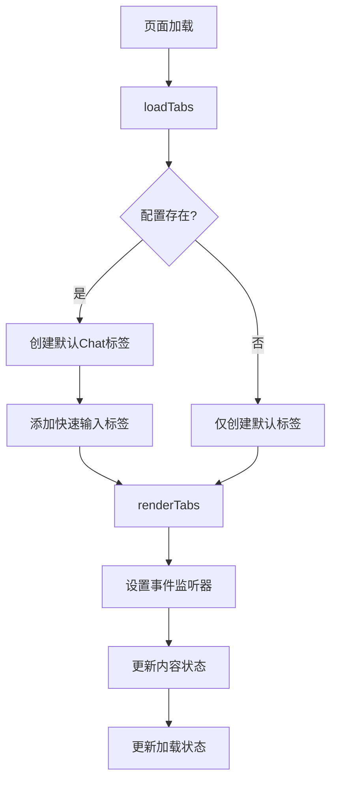
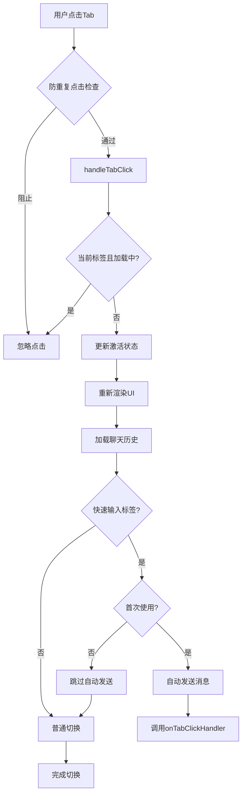
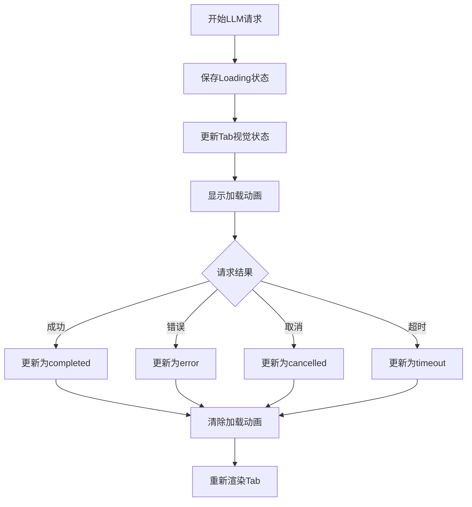
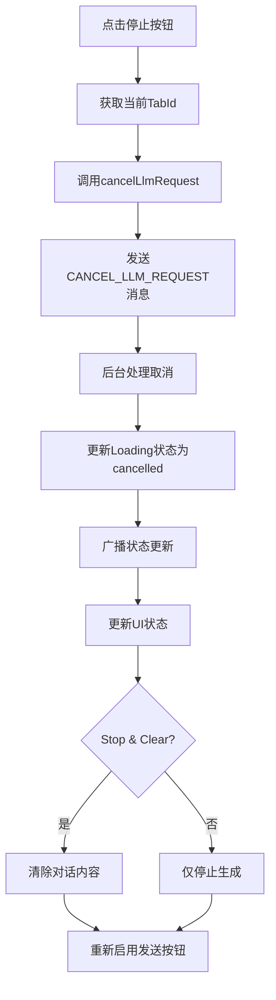
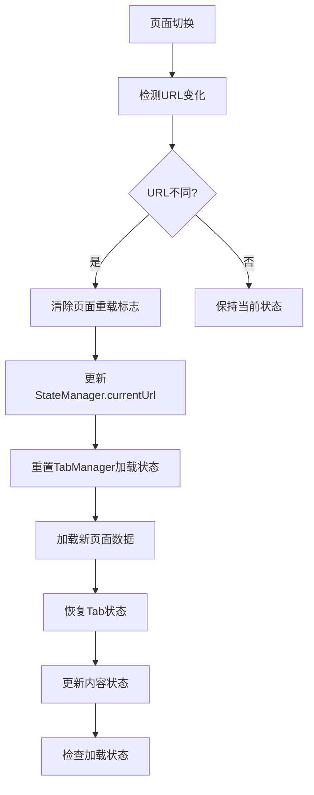
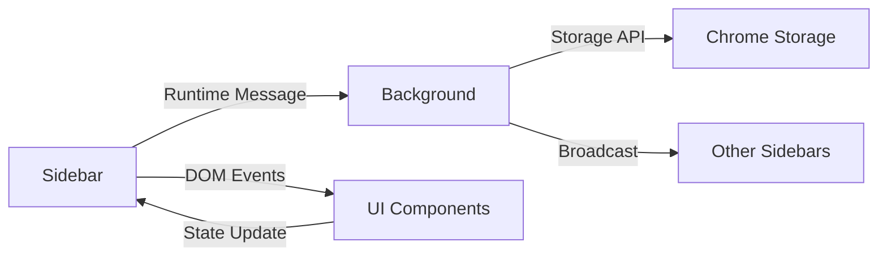

# Tab系统交互、数据流转和状态管理文档

## 概述

Think Bot Chrome扩展的Tab系统是一个复杂的多层架构，支持多个对话标签页的独立管理，包括默认聊天标签和快速输入标签。本文档详细描述了tab相关的交互逻辑、数据流转和状态管理机制。

## 核心组件架构

### 1. Tab Manager (`sidebar/components/tab-manager.js`)
- **职责**: Tab的创建、渲染、状态管理和交互处理
- **核心状态**:
  - `tabs[]`: 所有标签页的数组
  - `activeTabId`: 当前激活的标签页ID
  - `isRendering`: 防止并发渲染的标志
  - `isHandlingTabClick`: 防止并发点击处理的标志

### 2. Loading State Cache (`js/modules/loading_state_cache.js`)
- **职责**: 管理LLM请求的加载状态，支持超时处理和状态压缩
- **状态类型**: `loading`, `completed`, `error`, `cancelled`, `timeout`

### 3. Chat Manager (`sidebar/modules/chat-manager.js`)
- **职责**: 处理聊天消息、停止按钮和对话清除功能

## Tab状态模型

### Tab对象结构
```javascript
{
  id: string,              // 标签页唯一标识
  displayText: string,     // 显示文本
  sendText: string,        // 发送文本模板（快速输入）
  isDefault: boolean,      // 是否为默认聊天标签
  isActive: boolean,       // 是否为当前激活标签
  hasInitialized: boolean, // 是否已初始化
  hasContent: boolean,     // 是否有聊天内容
  isLoading: boolean,      // 是否正在加载
  quickInputId: string     // 快速输入ID
}
```

### Loading状态模型
```javascript
{
  status: 'loading|completed|error|cancelled|timeout',
  timestamp: number,       // 开始时间戳
  url: string,            // 页面URL
  tabId: string,          // 标签页ID
  messageCount: number,   // 消息数量
  result?: any,           // 完成结果
  error?: string,         // 错误信息
  completedTimestamp?: number,
  cancelledTimestamp?: number,
  timeoutTimestamp?: number
}
```

## 核心交互流程

### 1. Tab初始化流程



### 2. Tab切换流程



### 3. Loading状态管理流程



## 停止按钮交互逻辑

### 1. 停止按钮类型
- **Stop Button** (`stop-request-btn`): 仅停止当前生成
- **Stop & Clear Button** (`stop-clear-btn`): 停止生成并清除对话

### 2. 停止流程


### 3. 停止按钮的实现细节
- 停止按钮在流式响应期间显示在消息旁边
- 点击后立即取消后台LLM请求
- 更新Tab的loading状态为false
- Stop & Clear按钮具有与右下角清除按钮相同的功能

## 页面切换和Tab状态同步

### 1. 页面切换检测
- **Tab Activation**: `chrome.tabs.onActivated`监听器
- **Tab Update**: `chrome.tabs.onUpdated`监听器
- **URL Change**: 通过`TAB_CHANGED`消息通知sidebar

### 2. 状态同步机制


### 3. 跨页面状态管理
- 每个页面URL对应独立的Tab状态
- Loading状态按`${url}#${tabId}`键值存储
- 聊天历史按相同键值缓存
- 页面切换时重置UI状态但保留后台请求

## 数据流转架构

### 1. 状态存储层次
```
Chrome Storage (持久化)
├── loading_state_${url}#${tabId} (Loading状态)
├── chat_history_${url}#${tabId} (聊天历史)
├── page_content_${url}_${method} (页面内容)
└── page_state_${url} (页面状态)

Memory (运行时)
├── StateManager.state (应用状态)
├── TabManager.tabs[] (Tab状态)
└── UIManager.elements (UI元素引用)
```

### 2. 消息通信流


### 3. 关键消息类型
- `GET_LOADING_STATE` / `LOADING_STATE_RESPONSE`
- `CANCEL_LLM_REQUEST` / `LLM_REQUEST_CANCELLED`
- `CLEAR_LOADING_STATE` / `LOADING_STATE_CLEARED`
- `GET_CHAT_HISTORY` / `CHAT_HISTORY_RESPONSE`
- `TAB_CHANGED` / `AUTO_LOAD_CONTENT`

## 性能优化策略

### 1. 渲染优化
- **防抖机制**: `isRendering`标志防止并发渲染
- **增量更新**: `renderTabs(container, true)`跳过加载状态更新
- **批量更新**: 静默更新后统一渲染

### 2. 状态管理优化
- **状态压缩**: 大型Loading状态自动压缩存储
- **超时清理**: 20分钟后自动清理过期Loading状态
- **缓存策略**: 聊天历史和页面内容分层缓存

### 3. 内存管理
- **事件监听器清理**: Tab重新渲染时清理旧监听器
- **状态同步**: 避免重复的状态检查和更新
- **垃圾回收**: 定期清理过期的Loading状态

## 错误处理和容错机制

### 1. Tab操作容错
- 点击处理中的并发保护
- 渲染失败时的回退机制
- 状态不一致时的自动修复

### 2. Loading状态容错
- 网络错误时的状态恢复
- 超时检测和自动取消
- 状态丢失时的重建机制

### 3. 页面切换容错
- URL变化时的状态清理
- 跨页面状态隔离
- 异常情况下的默认状态恢复

## 调试和监控

### 1. 日志系统
- 模块化日志记录 (`createLogger`)
- 关键操作的详细日志
- 错误和警告的分级记录

### 2. 状态检查工具
- Tab状态的实时监控
- Loading状态的可视化指示
- 性能指标的收集和分析

这个Tab系统通过精心设计的状态管理、事件处理和数据流转机制，实现了复杂的多标签页对话管理功能，同时保持了良好的性能和用户体验。
